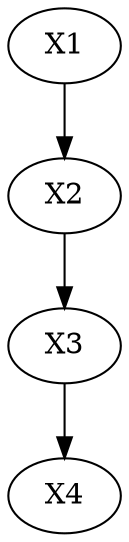
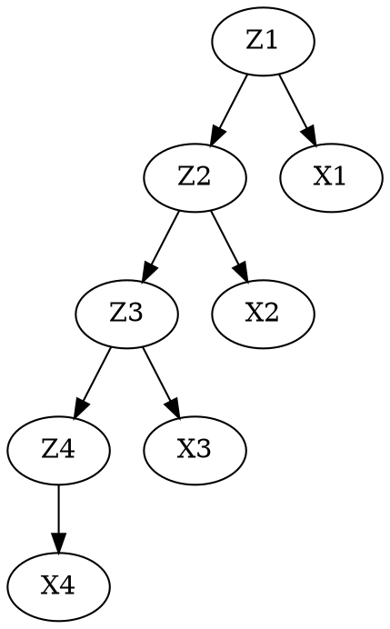

# Hidden Markov Models

## Markov Models
### Introduction
Markov models are a class of models for making predictions on sequential data.
The majority of statistical learning models are designed to handle standard datasets where we can reasonably assume each sample is i.i.d..
For sequential data, such as the price of an asset over time, successive data points are highly correlated and are therefore not i.i.d..

The base assumption for Markov models is that future predictions are dependent on only the most recent observations.
We can assume that tomorrow's value depends only on today's value (`first-order Markov chain`),
or only on the previous two day's values (`second-order Markov chain`).

In general, we can assume that tomorrow's value depends only on the last M days (sometimes call the Markov assumption of order M).

However, it's important to know that we are making a big trade-off: the higher the order M of our Markov chain, the more parameters we need to estimate. Problematically, the number of parameters increases exponentially with respect to M. So in order to have a reasonably large size for M, we will need to estimate some very complicated conditional distributions. We may choose to make these estimations with something simple like an autoregressive model, or with something complicated like a neural network, but you can't do anything to avoid this fundamental trade off.

So how do we handle this problem?
By using latent variables.

We will use latent variables to create a new class of models: state space models.
Then we'll look at two types of state space models: Hidden Markov models and linear dynamical systems.

## Latent Variables and State Space Model

